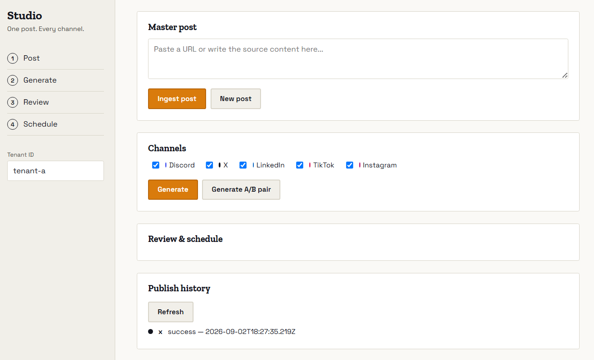

# Social Media Studio
Turn one blog post into a tailored campaign across multiple platforms - a short punchy version for X, a professional one for LinkedIn, a hooky caption for TikTok, and more - with human approval before anything publishes, and a scheduler that guarantess each approved post goes out exactly once, even under retries or a crash mid batch. 

Built as a capstone project for the FlyRank AI Backend Engineering internship. 

## What it does
1) **Ingest a blog post** (URL or raw text) - stored once as the single source of truth.
2) **Generate** a platform specific variant for each configured platform. Uses a real LLM (OpenRouter free tier) to write tailored content per platform, with automatic fallback to hand-written templates if the AI call fails or is disabled. Every variant, AI written or template, is validated against that platform's constraint profile (length, tone, hashtag count, and a grounding check against the source post) before it is stored. A rule breaking variant never reaches the review.  
3) **Review** each variant: approve, edit or reject. Only approved variants can be scheduled. 
4) **Schedule and publish**: an approved variant is scheduled for a time slot; a durable, crash-sage worker publishes it *exactly* once through a `SocialPublisher` adapter - a real Discord webhook, or a mock adapter (X, LinkedIn, TikTok, Instagram) that records what it would have posted. 

## Dashboard
A full web UI at `http://localhost:3000/`. There is no need to test via terminal. Ingest a post, pick platforms, generate (with a loading indicator during AI calls), review each variant (with a badge showing whether it is AI-written, template fallback, or manually overriden), approve/edit/reject, schedule and watch publish history, all from the browser. 



## Architecture
```
[blog post: URL or markdown]
        |
        v
   ingest + store  --->  variant generator (AI, with template fallback)  --->  constraint validation
        |                                                                          (length, tone, hashtags, grounding)
        v
   review workflow: draft -> approved | rejected  (blocked variants never reach review)
        |
        v
   scheduler (durable, DB-backed job store — resumes correctly after a restart)
        |
        v
   SocialPublisher interface
     +-- DiscordPublisher (real, via webhook)
     +-- MockXPublisher / MockLinkedInPublisher / MockTikTokPublisher / MockInstagramPublisher
        |
        v
   publish history: one slot = one post, always (idempotent, proven under restart)
```

Every layer (posts, variants, schedule slots, publish history) is scoped to a `tenant_id` - set via an `X-Tenant-Id` header on every request - so multiple isolated clients can use the same system without ever seeing each other's data.

## Setup 
```
git clone https://github.com/YOUR_USERNAME/social-media-studio.git
cd social-media-studio
npm install
```

Create `.env` (see `.env.example`):
```
DISCORD_WEBHOOK_URL=your_discord_webhook_url
LLM_BASE_URL=https://openrouter.ai/api/v1
LLM_API_KEY=your_openrouter_key
LLM_MODEL=openrouter/free
DISCORD_GUILD_ID=your_discord_server_id
```

Then run:
```
npm start
```

Open `http://localhost:3000/` for the dashboard.

## Usage example (API, if not using the dashboard)
```
# 1. Ingest a post
curl -X POST http://localhost:3000/posts \
  -H "Content-Type: application/json" \
  -d '{"source":"my-blog","content":"We just shipped a new feature..."}'

# 2. Generate variants for chosen platforms
curl -X POST http://localhost:3000/posts/<post_id>/generate \
  -H "Content-Type: application/json" \
  -d '{"platforms":["x","linkedin","discord"]}'

# 3. Approve a variant
curl -X POST http://localhost:3000/variants/<variant_id>/approve

# 4. Schedule it
curl -X POST http://localhost:3000/variants/<variant_id>/schedule \
  -H "Content-Type: application/json" \
  -d '{"scheduledAt":"2026-09-05T12:00:00Z"}'

# The durable worker publishes it automatically when the time arrives — 
# no manual publish call needed. Check status:
curl http://localhost:3000/publish-history
```

## Constraint profiles
See `DESIGN.md` for the full table. 

## Evidence
See `EVIDENCE.md` for proof of each requirement (idempotent publishing, constraint reinforcement, review workflow, adapter swap, etc.).

## AI Usage
See `BUILDLOG.md` for an honest log where AI helped, where it was wrong and what changed. 

## Hosting
Not deployed. Deliberately kept local-only: the capstone's own free-tools table states hosting is not required ("everything runs locally"), and this app specifically depends on a long-running background worker (`setInterval` polling every 5s) and local SQLite disk writes - both of which are fundamentally incompatible with a serverless platform like Vercel, which spins up stateless, ephemeral function instances per request. A future deploy, if wanted, would target a platform that supports a genuinely persistent process (e.g. `Fly.io` or `Render`), not serverless.

## Limitations
- Only Discord is a real, live publishing target; X, LinkedIn, TikTok, and Instagram are mock adapters, per the capstone's explicit scope.
- URL ingestion extracts the full page's stripped text, including navigation/UI content, not just the article body 
- OpenRouter's free tier has real response-time variance (observed 2s to 45s+ per call). The app handles this gracefully (timeout + template fallback), but it means AI-generated content isn't guaranteed on every request, especially for platforms with tight constraints (TikTok's combination of a 150-char limit, mandatory emoji, and hashtag cap was observed to trigger fallback more often than other platforms).
- No retry-with-backoff on a failed publish attempt (e.g. Discord webhook temporarily down). A failed slot is marked failed and would need manual re-triggering rather than automatic retry.